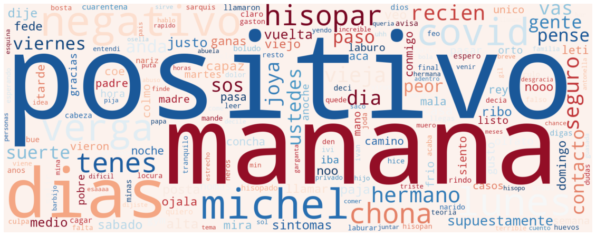
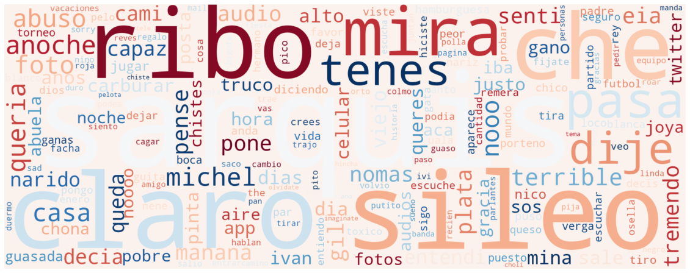

# Topic Modeling aplicado a mensajes de un chat grupal de WhatsApp

<!-- TABLE OF CONTENTS -->
<details open="open">
  <summary><h2 style="display: inline-block">Tabla de contenidos</h2></summary>
  <ul>
    <li><a href="#instalacion">Instalacion</a></li>
    <li><a href="#objetivo">Objetivo</a></li>
    <li><a href="#pipeline de preocesamiento">Pipeline de procesamiento</a></li>
    <li><a href="#parseo">Parseo</a></li>
    <li><a href="#pre-procesamiento">Pre-procesamiento</a></li>
    <li><a href="#clustering">Clustering</a></li>
    <li><a href="#vectorizacion">Vectorizacion</a></li>
    <li><a href="#entrenamiento">Entrenamiento</a></li>
    <li><a href="#predicciones y uso del modelo">Predicciones y uso del modelo</a></li>
    <li><a href="#conclusion">Conclusion</a></li>
    <li><a href="#contacto">Contacto</a></li>
  </ul>
</details>
<br/><br/>

## Instalación:
Podemos utilizar Google Collab para correr desde ahí la notebook. Solo debemos asegurarnos de correr la primera celda para instalar las dependencias antes de correr el resto de la notebook. Vamos a necesitar tener nuestro archivo de chat en Google drive, y darle acceso a Collab para poder cargar los mensajes.
<br/><br/>

## Objetivo:
El objetivo es lograr, a partir del contenido de un mensaje de WhatsApp, el tema sobre el cual trata el mensaje, usando datos no etiquetados como puede ser un chat grupal.

Entonces, se podría tomar un mensaje como por ejemplo:

	“¿Vieron el partido del sábado?”

y nuestro modelo nos devolverá

	“Fútbol” o “Deportes”

En este caso particular se usó un chat de un grupo propio de varios amigos, con el permiso de todos ellos.
<br/><br/>

## Pipeline de procesamiento:

Las distintas etapas por las cuales van a pasar los mensajes son las siguientes:
- Parseo
- Preprocesamiento
- Clustering
- Vectorización de mensajes
- Entrenamiento del modelo
- Predicción
<br/><br/>

## Parseo
Cuando descargamos desde WhatsApp el historial de mensajes de un grupo, (acá pueden ver como exportar sus propios chats) obtenemos un archivo de texto donde cada mensaje tiene el siguiente formato:

	17/9/2020 12:47 - Nacho Baldoncini: bien pa

De cada mensaje podemos obtener fecha y hora, autor y contenido.
Al momento de formatear cada mensaje, nos fijamos si el mensaje anterior fue escrito por el mismo autor, y si fue enviado en lapso corto de tiempo respecto al mensaje anterior, se los considera como un único mensaje. Esto es para que mensajes como estos:

	17/9/2020 12:47 - Nacho Baldoncini: hola
	17/9/2020 12:50 - Nacho Baldoncini: como están?

Se interpreten como:

	17/9/2020 12:47 - Nacho Baldoncini: hola, como están?

Para ello, una función se encarga de extraer cada parte y ordenarla en un diccionario con el siguiente formato para cada mensaje:

```bash
{
	author: Creador del mensaje,
	text: Contenido del mensaje,
	time: Hora del mensaje,
	day: Día del mensaje
}
```

Una vez que tenemos una lista de estos diccionarios, donde cada uno corresponde a un mensaje, podemos avanzar a la etapa de preprocesado.
<br/><br/>
## Pre-procesamiento
El objetivo de esta etapa es llevar nuestros mensajes de ser una simple string, a ser un doc de Spacy, en donde:
- Eliminamos las stopwords
- Eliminamos palabras con 2 caracteres o menos
- Solo nos quedamos con los mensajes que tengan más de 1 palabra

Para las stopwords se usó esta lista, además de algunas stopwords personalizadas que se vieron aparecer mucho en el contexto de este grupo específico de WhatsApp

Algo que es muy común encontrar en un chat de WhatsApp es alguna expresión de “risa”, como puede ser “jaja” o “ajajaj”, el problema es que puede escribirse de muchas maneras distintas, “jja”, “ja”, “jaja”, “ajjaj”.

Entonces, para poder eliminar estas palabras, se definió la siguiente heurística:

Si la palabra tiene una cantidad de letras ‘j’ mayor a ⅓ de la longitud total de la palabra, entonces es considerada una risa y puede ser eliminada. No es una regla 100% precisa, pues algunas palabras que no son risa pueden ser consideradas como tal, como por ejemplo la sigla “jjoo” (Juegos olímpicos), pero fuera de esos casos extremos, funciona bastante bien.

Ahora, logramos llevar nuestro mensaje de esto:
	
	'Eu mañana es el cumple de la Anto, le podríamos mandar algo'

A esto:

	['manana', 'cumple', 'anto', 'mandar']
<br/><br/>
  
## Clustering  
Originalmente, se pensó en utilizar LDA para clusterizar los mensajes, pero luego de múltiples pruebas con diferentes parámetros, no se logró obtener clusters que tengan mucho sentido, ni siquiera yo, un participante del grupo con el que trabajé, fui capaz de encontrarle una semántica real a los clusters.

Luego de investigar alternativas, llegué a la conclusión de que, LDA no es óptimo al momento de clusterizar mensajes cortos, sino más bien textos más completos como puede ser un artículo. Finalmente, opte por utilizar  GSDMM, un algoritmo de clusterización que tiene muy buena performance con textos cortos. Los autores del paper original son Jianhua Yin  y Jianyong Wang, y pueden encontrarlo [aquí](https://sci-hub.se/10.1145/2623330.2623715).

También es recomendado leer [este posteo](https://towardsdatascience.com/short-text-topic-modelling-lda-vs-gsdmm-20f1db742e14), en donde se hace una comparación de GSDMM vs LDA.

Para poder imaginarse como funciona el algoritmo, presento el siguiente ejemplo (sacado del post previamente mencionado):

“Imagina un grupo de estudiantes sentados aleatoriamente en K mesas, a todos les pedimos que escriban sus películas favoritas en una hoja (pero debe ser una lista corta). El objetivo es agruparlos de tal manera que los estudiantes en el mismo grupo, compartan los mismos intereses de cine, para ello, uno tras otro, los estudiantes deben elegir cambiarse de mesa siguiendo las siguientes reglas:
Regla 1: Elegir una mesa con más estudiantes, esta regla ayuda con la completitud, todos los estudiantes con los mismos intereses son asignados a la misma mesa.

Regla 2: Elegir una mesa donde los estudiantes comparten tus intereses, lo que incrementa la homogeneidad, solo queremos que estudiantes que compartan intereses estén en una misma mesa.

Luego de repetir este proceso, esperamos que algunas mesas empiecen a crecer y que otras desaparezcan, y eventualmente tendremos clusters de estudiantes que comparten sus intereses. Simplemente eso es lo que hace GSDMM!”


Luego de correr la clusterización con GSDMM, y ajustar manualmente la cantidad de clusters, los clusters resultantes tienen bastante sentido, por ejemplo, acá podemos ver la nube resultante de un cluster donde su tópico es bastante claro:



El chat fue exportado a mediados de 2021, por lo que tiene sentido tener un cluster relacionado al Covid-19, con palabras como hisopar, positivo, negativo, cuarentena, covid, contacto, entre otras.

Aún asi, el algoritmo de clusterización no logra identificar por completo los tópicos de los mensajes, por lo que  algunos clusters no son tan claros




En este vemos muchos nombres, y palabras variadas, pero no es de mucha utilidad al momento de definir el tema de algún mensaje.

Ahora debemos etiquetar manualmente cada uno de nuestros clusters, para que sean más cómodos de interpretar los resultados de las predicciones, aunque no tenga efecto real sobre el modelo. En este caso, estos fueron los míos:

1. Juntarse
2. Covid
3. Gente
4. Undefined
5. Juntarse
6. Futbol
7. Undefined
8. Salida

Los clusters que no tenían demasiado sentido, fueron etiquetados como “Undefined”.
Ahora que tenemos nuestros clusters, podemos pasar a la siguiente etapa.
<br/><br/>

## Vectorización
Para poder darle a un modelo de ML como XGBoost nuestros mensajes como inputs, se utilizó el siguiente [Word Embedding](https://drive.google.com/file/d/1J06BUDIjUQOtWkv7aM1AjS9e59Wf-OcG/view?usp=sharing) para vectorizar los mensajes y llevarlos de ser simples listas de palabras, a ser vectores de 100 coordenadas, un tipo de dato muy tabularizable y amigable para XGBoost.
<br/><br/>

## Entrenamiento
Ahora que convertimos nuestros mensajes a un dataframe de vectores que representan a cada mensaje, y que está etiquetado con el cluster al cual el mensaje pertenecía, podemos entrenar nuestro XGBoost Classifier.
Solo debemos instanciar nuestro modelo, y pasarle al método fit, nuestros dataframes con vectores y etiquetas, respectivamente:

```bash
from xgboost import XGBClassifier

model = XGBClassifier()
model.fit(vector_df, tag_df[0])
```
<br/><br/>
## Predicciones y uso del Modelo
Para poder predecir el tema de un mensaje nuevo, debemos procesarlo de acuerdo al pre procesamiento que realizamos previo al proceso de clustering, esto sería:
1. Parseo
2. Preproceso
3. Vectorizarlo

Y ese producto final se lo podemos entregar a XGBoost para que nos ayude a determinar el tema del mensaje. Probemos predecir el tópico con algunos mensajes que no estaban dentro del dataset usado para entrenar:

    mensaje: me dio positivo el hisopado, adentro 15 dias
    predicción: Covid

<br/>

    mensaje: Eu ya compramos para las sangrías, alguien compre el hielo
    predicción: Juntarse

<br/>

    mensaje: Que bien juega messi
    predicción: Futbol

<br/>

    mensaje: Estoy sentado en un cráter desierto, sigo esperando el temblor
    predicción: Juntarse

<br/>
    
    mensaje: Será lo tembloroso de la espuma bailando en mi corazón rabioso
    predicción: Juntarse

## Conclusión
Se logró a partir de datos completamente no etiquetados, y algo de trabajo manual para poder etiquetar los clusters, generar algunas predicciones, que cuando el tópico de el mensaje es claro, y está contenido dentro del mismo mensaje, es muy probable que el modelo prediga correctamente su tema, pero si los mensajes son más dependiente del contexto, el modelo empieza a equivocarse.

La irregularidad de los mensajes que normalmente se envían de Whatsapp presenta una gran dificultad al momento de querer analizarlos, además de que su naturaleza privada hace muy complicado la existencia de algún dataset etiquetado de los mismos. Y aunque dicho conjunto de datos existiera, sería solo funcional dentro del contexto de los chats propios de una organización, chat, o grupo de amigos , ya que cada grupo tiene sus modismos y formas distintas de escribir. Sin embargo, no es imposible un acercamiento no supervisado, y no está fuera de alcance lograr un cierto nivel de precisión aceptable para la extracción de información de mensajes originados en un chat.

## Contacto
[LinkedIn](https://www.linkedin.com/in/ibaldoncini/)

[Email](mailto:ijbaldoncini@gmail.com)


